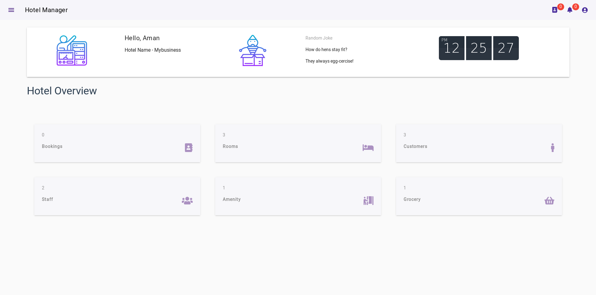
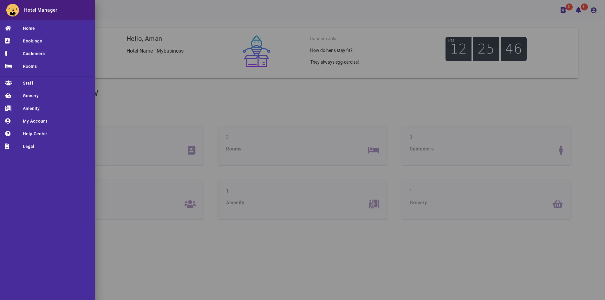
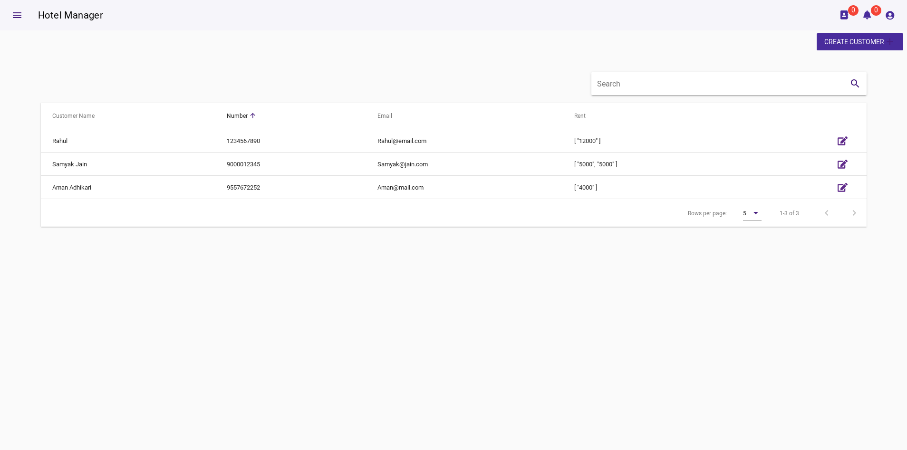
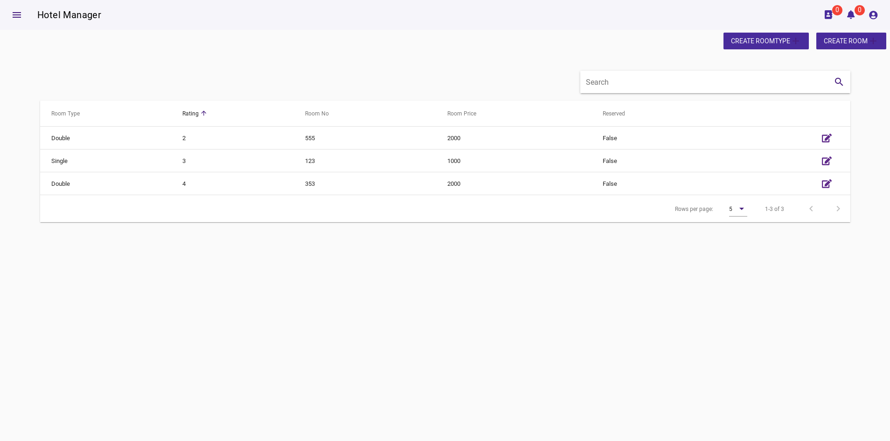
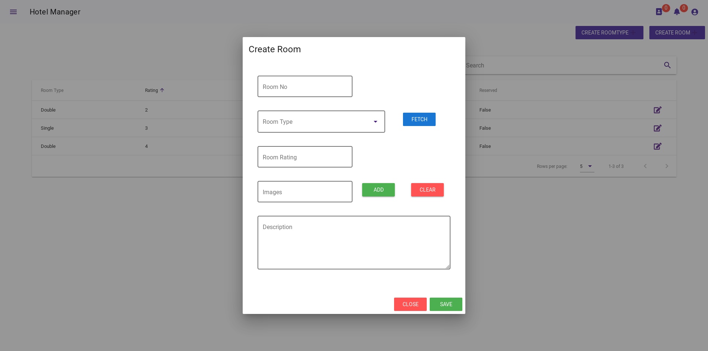
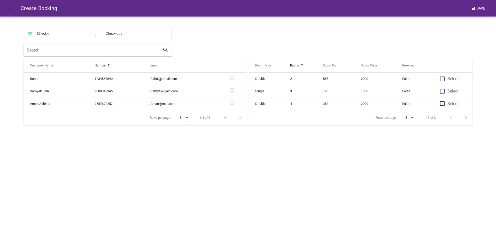
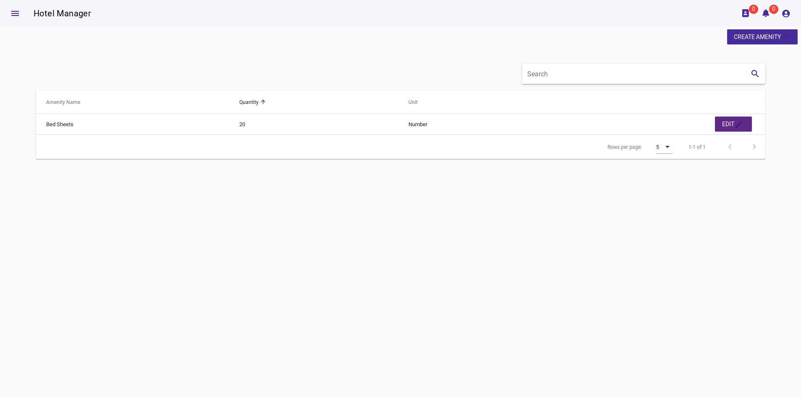
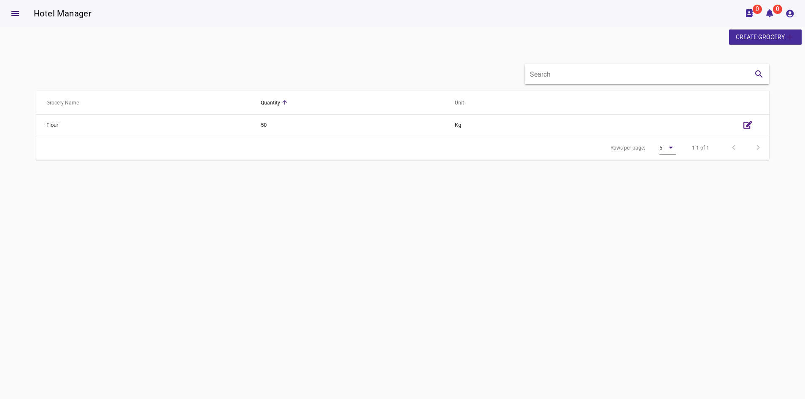

# CauseCode Challenge
## Hotel Inventory Application

[Test URL][797556c7]

## Description
This is a VueJS based web application that can be easily build and deployed to create your own Hotel Inventory Software.
The Project is free to use and runs on any mordern web browser.
## Technologies/Framework
- VueJS
- Vuetify
- Nodejs
- AWS Serverless
- MongoDB

  [797556c7]: http://hotel-booking-app.s3-website.ap-south-1.amazonaws.com/ "test url"

### Vuejs Packages
- Veevalidate
- Vuex
- VueAxios
- VueClock
- FontAwesomeIcon
- HotelDatePicker

### Nodejs Packages
- validator
- bluebird
- mongoose
- crypto
- jwt

# Features
1. **Room Booking** - Manager can create a booking on name of registred customer defining check in and checkout date and assigning single or multiple rooms.
2. **Room Creation** - Manager first need to create a type of room then create rooms in the database.
3. **Customer Managment** - Before booking, Manager needs to register a customer.
4. **Staff Managment** - Manager can keep track of all the staff.
5. **Amenity Stock Managment** - Manager can view and create amenity.
6. **Grocery Stock Managment** - Manager can handle grocery.

# Database Schema

[Created at dbdiagrams.io][50990eb6]

  [50990eb6]: https://dbdiagram.io/ "Link"

# Design & UI
Simple material besed theme, The UI can be customized as this project uses vuetify so more featres and styles can be implemented, Any one can customize the components.
## Screenshots
### Home

### Side Menu

### Customers

### Rooms

### Create rooms

### Booking

### Amenity

### Grocery

Some components are not shown here.
# Upcoming Features
1. Notification Support
2. Mangage Bills
3. UI Improvements

# Software Used
- Atom IDE
- Postman
