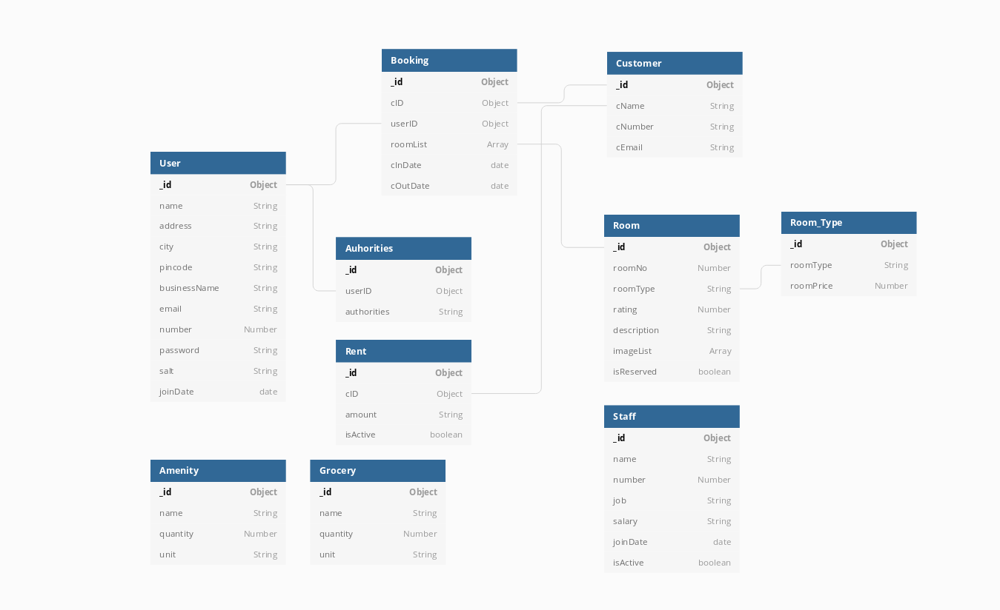

# CauseCode Challenge
## Hotel Inventory Application
## Description
This is a VueJS based web application that can be easily build and deployed to create your own Hotel Inventory Software.
The Project is free to use and run on any mordern web browser.
## Technologies/Framework
- VueJS
- Vuetify
- Nodejs
- AWS Serverless
- MongoDB

### Vuejs Packages
- Veevalidate
- Vuex
- VueAxios
- VueClock
- FontAwesomeIcon
- HotelDatePicker

### Nodejs Packages
- validator
- bluebird
- mongoose
- crypto
- jwt

# Features
1. **Room Booking** - Manager can create a booking on name of registred customer defining check in and checkout date and assigning single or multiple rooms.
2. **Room Creation** - Manager first need to create a type of room then create rooms in the database.
3. **Customer Managment** - Before booking, Manager needs to register a customer.
4. **Staff Managment** - Manager can keep track of all the staff.
5. **Amenity Stock Managment** - Manager can view and create amenity.
6. **Grocery Stock Managment** - Manager can handle grocery.

# Databse Schema

